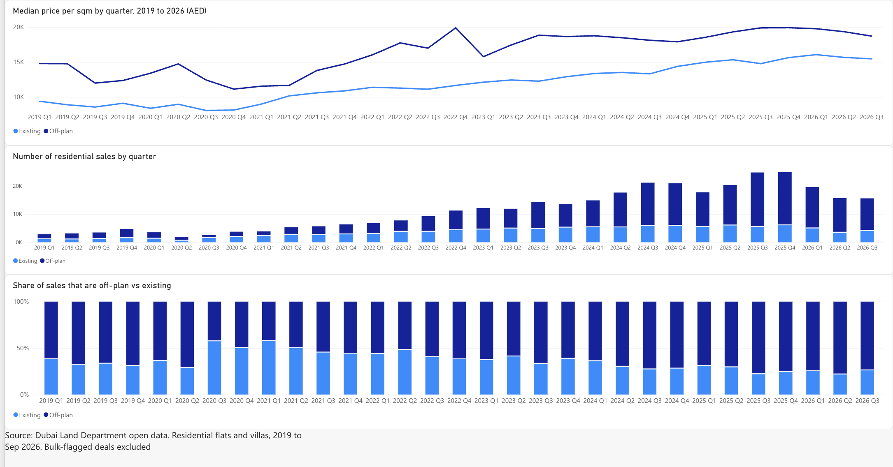
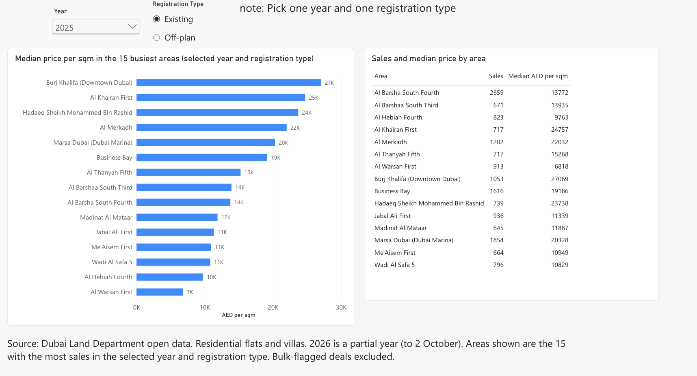
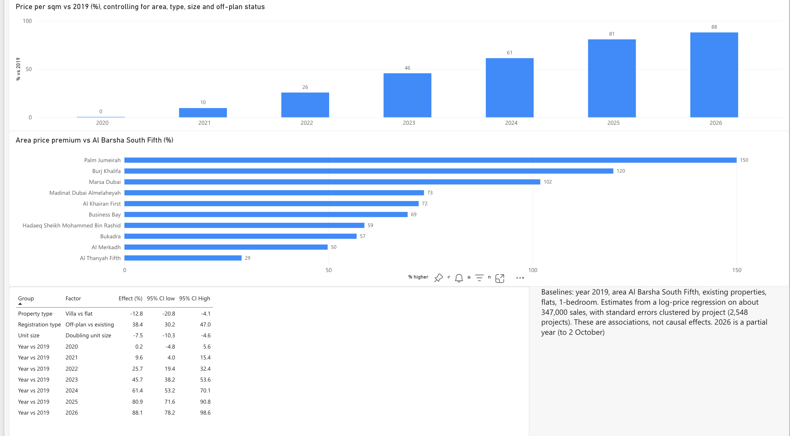

# Dubai Real Estate Market Analytics

End-to-end analysis of 348,789 registered residential sales from the Dubai Land Department (DLD), 2019 to 2 October 2026: Python cleaning, a PostgreSQL star schema, SQL analysis with window functions, a log-price regression with project-clustered standard errors, and a Power BI dashboard.

## Question

How has price per square metre moved in Dubai's residential market since 2019, and how much of the variation is associated with location, property type, unit size, and off-plan status?

## Data

- **Source:** Dubai Land Department open data via Dubai Pulse (registered transactions). The raw file is not included in this repo. Check the dataset's terms on Dubai Pulse before reusing it.
- **Raw file:** 898,413 transactions (sales, mortgages, gifts) dating back decades.
- **After cleaning:** 348,789 residential sales (flats and villas) from 2019 to 2 October 2026. Every removal is logged in `docs/cleaning_log.csv` and explained in `docs/cleaning_decisions.md`.
- **Composition:** about two-thirds of the cleaned sales are off-plan registrations, so findings about "the market" are largely findings about off-plan primary sales.

## Method

1. `src/01_inspect.py` checks the raw file and the column mapping.
2. `src/02_clean.py` cleans and logs each step: date parsing, 2019 start, sales only, a whitelist of three ordinary sale procedures, residential flats and villas, positive value and area, de-duplication, and removal of extreme price per sqm outliers (|z| > 4 within property sub type). Likely bulk or portfolio deals are flagged, not deleted.
3. `src/03_load.py` loads a star schema (`sql/schema.sql`) into PostgreSQL: one fact table and three dimensions.
4. `sql/analysis.sql` holds the analysis queries: medians by area and year, year-over-year change, rolling volume, area rankings, and off-plan versus existing.
5. `src/04b_stats_v2.py` fits an OLS regression on log price per sqm with controls for area, property sub type, registration type, year, rooms, and log unit size. Standard errors are clustered by project (2,548 clusters). It also re-fits the model without "Delayed Sell" registrations as a sensitivity check.
6. `src/05_export_for_bi.py` exports summary tables for the Power BI dashboard.

## Key findings

All estimates are associations, not causal effects. Percentages compare with the stated baseline, holding the other variables fixed.

1. **Prices rose strongly after 2020.** Price per sqm was flat in 2020 compared with 2019 (+0.2%, 95% CI -4.8% to +5.6%), then higher every year: about +81% in 2025 (CI 71.6% to 90.8%) and +88% in 2026 to 2 October (CI 78.2% to 98.6%).
2. **Off-plan sales carry a premium.** Off-plan price per sqm was about 38% above existing-property sales (CI 30.2% to 47.0%). Excluding "Delayed Sell" registrations raised the estimate to about 46%, so the exact size depends on that procedure.
3. **Location dominates.** Relative to Al Barsha South Fifth, Palm Jumeirah was about 150% higher (CI 116% to 189%), Burj Khalifa about 120% (CI 103% to 138%), and Marsa Dubai about 102% (CI 71% to 138%). The Palm and Marina intervals are wide, so those estimates are less certain than the single numbers suggest.
4. **Larger units cost less per sqm.** Doubling unit size was associated with about 7.5% lower price per sqm (CI -10.3% to -4.6%).
5. **Villas were about 12.8% lower per sqm than flats** (CI -20.8% to -4.1%), a secondary result.

Model fit: n = 346,882 sales (bulk-flagged rows excluded), R-squared = 0.594.

## Dashboard

A three-page Power BI report built from the exported summary tables:

- **Market:** median price per sqm by quarter, number of sales by quarter, and off-plan share of sales.
- **Areas:** median price per sqm and sales in the 15 busiest areas, for a selected year and registration type.
- **Drivers:** the regression effects with confidence intervals.





## Limitations

- Associations only. There are no controls for view, floor, finish quality, developer, or building age, and the model explains about 59% of the variation in log price per sqm.
- The year effects are not like-for-like price growth. The mix of buildings sold changes over time, and 2026 is a partial year.
- The bulk-deal flag is a heuristic (10 or more rows with the same date, area, and value) that flagged 1,907 rows. Results exclude them, and I have not tested how the findings change if they are included.
- I kept three procedures (Sell, Sell - Pre registration, Delayed Sell) and dropped seven smaller ones (about 2% of rows) whose price per sqm differed sharply. I do not know exactly what "Delayed Sell" covers, which is why the sensitivity check exists.
- Area names are official DLD area names, not marketing names. "Marsa Dubai" is Dubai Marina and "Burj Khalifa" covers Downtown Dubai. Other areas are shown as named in the data.
- Quarterly medians are noisy, especially for small areas, so dashboard values should be read for direction, not precision.

## What I would do next

- Add rental (Ejari) data to compare price growth with rent growth.
- Test how the findings change when bulk-flagged deals are included.
- Add building-level controls where the data allows, and test a mixed-effects model with project as a random effect.
- Build a natural-language-to-SQL assistant over the database.

## Reproduce

```bash
pip install -r requirements.txt
pip install "psycopg[binary]"     # driver used by SQLAlchemy for PostgreSQL URLs
# 1. Download the DLD transactions CSV from Dubai Pulse and save it as data/raw/dld_transactions.csv
# 2. Start a local PostgreSQL server (Postgres.app, or `docker compose up -d`) and create a database
createdb dubai_re
export DATABASE_URL=postgresql://localhost:5432/dubai_re
export PYTHONPATH=.
python3 src/01_inspect.py
python3 src/02_clean.py
python3 src/03_load.py
python3 src/04b_stats_v2.py
python3 src/05_export_for_bi.py
```

`config.py` holds the column mapping, the analysis window, the procedure whitelist, and the residential sub types. `src/04_stats.py` is a first, simpler model kept for reference. The results above come from `src/04b_stats_v2.py`.
